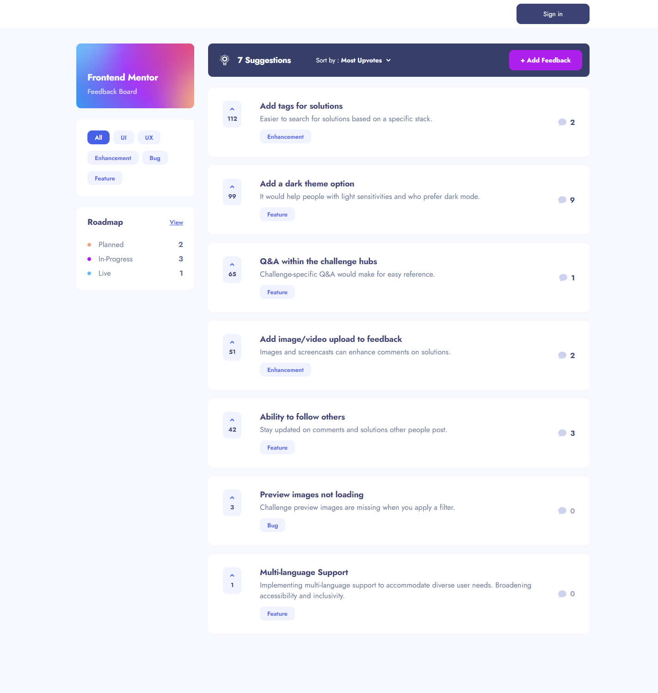

# Product Feedback App

This repository showcases my solution to the [Product Feedback App challenge on Frontend Mentor](https://www.frontendmentor.io/challenges/product-feedback-app-wbvUYqjR6). Frontend Mentor challenges help you improve your coding skills by building realistic projects.

## Table of Contents

- [Overview](#overview)
  - [The Challenge](#the-challenge)
  - [Screenshot](#screenshot)
  - [Links](#links)
- [My Process](#my-process)
  - [Built With](#built-with)
  - [Expected Behaviour](#expected-behaviour)
  - [What I Learned](#what-i-learned)
  - [Continued Development](#continued-development)
  - [Useful Resources](#useful-resources)

## Overview

### The Challenge

Users should be able to:

- View the optimal layout for the app depending on their device's screen size
- See hover states for all interactive elements on the page
- Create, read, update, and delete product feedback requests
- Receive form validations when trying to create/edit feedback requests
- Sort suggestions by most/least upvotes and most/least comments
- Filter suggestions by category
- Add comments and replies to a product feedback request
- Upvote product feedback requests
- **Bonus**: Keep track of any changes, even after refreshing the browser (`localStorage` could be used for this if you're not building out a full-stack app)

### Screenshot

### Links

- Live Site URL: [Vercel](https://product-feedback-app-rgomes98.vercel.app/)
- Solution URL: [Frontend Mentor](https://www.frontendmentor.io/solutions/product-feedback-app-solution-4sHjYC61OV)

## My Process

### Built With

- Next.js: Chosen for its powerful features like server-side rendering, static site generation, and routing, which enhance performance and SEO capabilities.
- Prisma: Selected for its ease of use and efficiency in database management, enabling seamless integration with PostgreSQL and simplifying data access operations.
- Auth.js: Implemented to facilitate authentication functionalities seamlessly with various providers like GitHub, Google, and Twitter, ensuring secure access to the application.
- Zod: Employed for its robust schema validation capabilities, enhancing data integrity and ensuring consistent data structures throughout the application.
- SASS: Utilized to streamline CSS development with features like variables, mixins, and nesting, improving code organization and maintainability.
- TypeScript: Chosen to enhance code quality and developer productivity through static typing, enabling early error detection and improved code documentation.
- React: Leveraged for building dynamic and interactive user interfaces, providing a component-based architecture and efficient state management capabilities.
- Figma: Used for following the design specifications provided in the challenge.
- PostgreSQL: Selected for its reliability, scalability, and advanced features, serving as the primary database management system for the application.
- Vercel: Opted for hosting the application, leveraging its seamless integration with Next.js and efficient deployment workflows for fast and reliable hosting.

### Expected Behaviour

In the development of this product feedback app, certain expected behaviors were defined to ensure a smooth user experience and efficient functionality:

- **Suggestions Page**

  - On the Suggestions page, only product feedback requests with a status of `suggestion` should be displayed. This ensures that users can easily access and review suggestions for potential product improvements.

- **Roadmap**

  - The roadmap section should showcase feedback requests with statuses of `planned`, `in-progress`, or `live`. These requests should be organized into columns based on their status, with each column ordered by upvote totals. This arrangement helps users track the progress of feedback implementation and prioritize based on community interest.

- **Creating a Product Request**

  - When users create a new piece of feedback, the system should automatically assign an ID. This ID should increment from the current highest product request ID by 1, ensuring each feedback item has a unique identifier. Additionally, the default status for a new piece of feedback should be set to `suggestion`, placing it on the Suggestions page for community review.

- **Editing Feedback**

  - If a piece of feedback undergoes a status update to `planned`, `in-progress`, or `live`, it should transition to the roadmap section accordingly. The feedback item should be placed in the appropriate column based on its new status, facilitating clear communication of its progress to users.

- **Adding Comments/Replies**

  - When users add comments or replies to feedback items, the system should utilize data from the current user session to populate user information. This information should be retrieved from the database, ensuring accurate and up-to-date user profiles are displayed. Additionally, comments and replies should be limited to a maximum of 250 characters, encouraging concise and focused communication among users.

- **Sign In Page**
  - A Sign In page has been incorporated into the project, allowing users to log in or create a new account using various authentication providers such as `Google`, `GitHub`, or `Twitter`. This feature enhances user experience by providing multiple options for authentication, catering to individual preferences and convenience. Users can seamlessly access the platform, ensuring a smooth and efficient interaction with the product feedback application.

### What I Learned

I learned how to integrate various technologies such as Next.js, Prisma, Auth.js, and PostgreSQL to create a full-stack application. Additionally, I gained experience in handling authentication with multiple providers and utilizing server-side actions in Next.js.

### Continued Development

In future projects, I aim to further enhance my skills in database management, user authentication, and frontend design. Additionally, I plan to delve deeper into server-side rendering and server actions to expand the capabilities of my applications and improve overall performance.

### Useful Resources

- [Next.js Documentation](https://nextjs.org/)
- [Prisma Documentation](https://www.prisma.io/)
- [Auth.js Documentation](https://authjs.dev/)
- [Zod Documentation](https://zod.dev/)
- [SASS Documentation](https://sass-lang.com/)
- [React Documentation](https://react.dev/)
